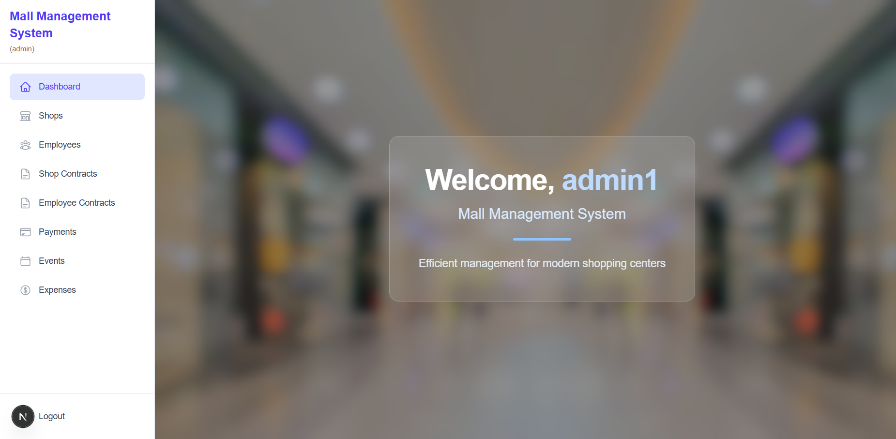

# 🏬 Mall Management System

A full-stack web application for managing shopping mall operations such as store rentals, employee contracts, and payments.

## 📌 Project Summary
- Centralizes mall data management using a MySQL relational database.
- Role-based access control for Admin, Accountant, and Manager users.
- Built with Next.js (frontend & backend) using raw SQL queries.
- Automates contract, payment, and event tracking with database triggers and views.

## 🛠️ Development Environment
- **Frontend & Backend:** Next.js 13+
- **Database:** MySQL
- **Authentication:** NextAuth (with JWT)
- **Language:** TypeScript / JavaScript
- **Package Manager:** npm or yarn

## 👤 User Roles

- **Admin:** Full access to all entities (shops, contracts, employees, events, payments).
- **Accountant:** View all records and manage payment approvals.
- **Manager:** Access only their own shops/contracts and submit payments.

## 📸 Interface Screenshot

> _(Insert a screenshot image of the dashboard here)_  
> Example:  
> 

## ⚙️ Features

- 🔐 Secure login with role-based dashboard redirection.
- 📊 Real-time database interaction with raw SQL queries.
- 🧾 Automatic logging and reporting via database triggers and views.
- ✅ RESTful API endpoints with built-in RBAC middleware.

## 🗄️ Database Setup

1. **Import the SQL schema:**

   The project includes a `mall_management_schema.sql` file that contains the full MySQL database structure (tables, relationships, views, and triggers).

2. **Steps to import:**

   - Open your MySQL client (e.g., phpMyAdmin, MySQL Workbench, or CLI).
   - Create a new database (e.g., `mall_management_db`).
   - Run the SQL script:
     ```bash
     mysql -u your_user -p mall_management_db < mall_management_schema.sql
     ```

3. **Update `.env.local`:**


## 🧑‍💻 How to Install & Run the Project

1. **Clone the repository:**
   ```bash
   git clone https://github.com/yourusername/mall-management-system.git
   cd mall-management-system
   ```
2. **Install dependencies:**
```bash
     npm install
```
3. **Install dependencies:**
in .env.local folder :
DATABASE_URL=your_mysql_connection_string
NEXTAUTH_SECRET=your_jwt_secret

4. **Run the development server:**
   ```bash
   git clone https://github.com/yourusername/mall-management-system.git
   cd mall-management-system


⚠️ The SQL file must be imported **before** running the project to avoid database errors.

## 🗄️ Database Setup

1. **Import the SQL schema:**

   The project includes a `mall_management_schema.sql` file that contains the full MySQL database structure (tables, relationships, views, and triggers).

2. **Steps to import:**

   - Open your MySQL client (e.g., phpMyAdmin, MySQL Workbench, or CLI).
   - Create a new database (e.g., `mall_management_db`).
   - Run the SQL script:
     ```bash
     mysql -u your_user -p mall_management_db < mall_management_schema.sql
     ```

3. **Update `.env.local`:**
